# 🚘 Asistente de Estacionamiento Autónomo para Cochera (USB permanente + corte periféricos)

Sistema de guiado visual de alta precisión para garajes basado en **ESPHome** sobre un microcontrolador **ESP8266 (NodeMCU v2)**. El dispositivo opera de forma **100% independiente** (sin requerir Home Assistant, dependencias de nube ni conexión continua a red Wi-Fi), con **NodeMCU siempre vivo por USB 5V/2A** y corte físico de periféricos (`MAX7219` + `HC-SR04` laterales + láseres) vía relé `HW-482` comandado por `GPIO` y `reed` en portón.

---

## 📋 Descripción del Proyecto y Arquitectura

El asistente utiliza tres sensores ultrasónicos (HC-SR04), tres módulos de diodo láser para marcar puntos de referencia visuales en el vehículo y una matriz de LED de $8\times32$ píxeles gobernada por cuatro controladores MAX7219 encadenados (DOUT→DIN).

### Principales Características
* **Corte físico de periféricos con NodeMCU siempre vivo:** `VIN` `5V USB` alimenta `COM+VCC HW-482`; `GPIO1/TX → S` pega el relé y `GPIO3/RX ← reed NO → GND` (`Par4`, `INPUT_PULLUP 50ms`, `Porton`) lo comanda. Con portón cerrado los periféricos quedan en `0mA` pero el `NodeMCU` sigue en `~70mA` por `USB` para `OTA/logs/web` instantáneos (antes `0W` total con `VIN` en serie con el reed).
* **Tolerancia a Fallos de Red:** Operación autónoma en modo AP (Punto de Acceso) local. Sin retardos por desconexiones o bloqueos por fallas de Wi-Fi.
* **Alineación Simétrica de Precisión:** Barra de progreso sólida desde el centro + marquesina 7x5 del usuario del lado libre en desvío + distancias 3x6 contra los márgenes con calado en negativo — para evitar colisiones laterales con espejos retrovisores o columnas.
* **Respuesta Dinámica según Sentido de Marcha:** Detecta automáticamente si el vehículo está ingresando (aproximación) o saliendo (retroceso), modificando el flujo visual de la pantalla.
* **Filtrado Peatonal:** Requiere la lectura simultánea de ambos sensores laterales para activar el modo de alineación, evitando falsas alarmas por paso de personas.
* **Suavizado de Lecturas:** Cada HC-SR04 publica en cm (`unit_of_measurement: "cm"`) con filtro de mediana de 5 muestras y disparo secuencial por turnos (round-robin cada 70 ms: fondo → izquierda → derecha, cada sensor se mide cada 210 ms) para que ningún eco interfiera con otro.
* **Modo STOP Invertido y Parpadeante:** Inversión fija de la matriz LED (`invert_on_off`) en zona crítica ($\le 10\text{ cm}$): fondo encendido / texto apagado, con parpadeo de brillo entre intensidad 12 y 7 (pico de consumo contenido).
* **Transición Inteligente a READY:** Apagado de alertas y cambio a `READY` tras un tiempo estático configurable ($10\text{ s}$) o en arranques con el vehículo ya estacionado.

---

## 📐 Estados del Sistema de Guiado Visual

| Estado | Condición de Activación | Representación Matriz LED ($8\times32$) | Simulación Web UI |
| :--- | :--- | :--- | :--- |
| **Arranque / Reposo** | Auto estático al encender o fuera de rango | **Radar espera**: punto 2×2 rebotando en x 8→30 a 1 px/frame (100 ms, KITT) + icono WiFi 8×8 en 0–7 (solo en espera, `parking.yaml:608-648`) | `[ wifi | ● radar ]` |
| **Retroceso / Salida** | Distancia de fondo aumentando ($> +1\text{ cm}$) | Misma marquesina `^` invertida verticalmente (baja) en laterales x=1 y x=24, ~300 ms/frame | `[      vv      ]` |
| **Alineación Lateral** | Ambos sensores laterales $\le 50\text{ cm}$ (+ histéresis 2 cm) | Arriba: barra de progreso sólida desde el centro a toda altura (filas 0–7, largo = magnitud del desvío); en desvío (> `umbral_desvio_chev`, histéresis 1 cm) marquesina 7×5 del usuario a ~100 ms/frame (tablas `CHEVDER` verbatim del GIF, espejada a la izquierda) del lado libre a la altura de los dígitos (filas 1–5), apuntando la corrección. Abajo: distancias 3x5 centradas verticalmente (filas 1–5) contra los márgenes; los píxeles tapados por la barra se ven invertidos (calado en negativo, p. ej. `30 | 30`) | `[ 45cm << : ║ 30cm ]` (valores en vivo) |
| **Aproximación Normal** | Distancia de fondo entre $50\text{ cm}$ y $150\text{ cm}$ | Distancia 3x6 a la izq + marquesina vertical `^` 7×8 del usuario (tablas `CHEVUP` verbatim del GIF, ~100 ms/frame; x2 en precaución/alerta) + barra de progreso 0–23 L→R (100% en x=23, col 24 libre; cala en negativo números, no el chevrón) | `«   120 cm   »` |
| **Precaución / Alerta**| Distancia de fondo entre $10\text{ cm}$ y $50\text{ cm}$ | Idem anterior con marquesina a mitad de velocidad (x2) y parpadeo de brillo en Alerta ($\le 20\text{ cm}$, 12↔7 como en STOP pero sin inversión) | `«   30 cm   »` |
| **STOP Crítico** | Distancia de fondo $\le 10\text{ cm}$ | Texto **`STOP`** gigante como mapa de bits libre de 32×8 a todo ancho (tabla `STOP32`, bit 31 = x0) con inversión fija y parpadeo de brillo (12 ↔ 7) | `[  S T O P  ]` |
| **Peligro Poste Lateral** | Algún lateral $\le 15\text{ cm}$ (estando en alineación, con switch activado) | Alterna pantalla de alineación con **`STOP`** invertido fijo (500 ms cada una) | `[  S T O P  ]` / valores en vivo |
| **Inactividad Post-STOP**| Vehículo estático $\le 10\text{ cm}$ durante $> 10\text{ s}$ | Pasa de `STOP` a **radar espera** (mismo que reposo, brillo máximo, sin inversión) | `[ wifi | ● radar ]` |
| **Sin lectura** | Sensor fondo `NaN` o $\le 0$ **y** sin presencia lateral (sin eco: sensor tapado o fuera de alcance) | Igual que reposo: **radar** + WiFi (conserva temporizadores, no congela inactividad) | `[ wifi | ● radar ]` |

> **Espera (radar + WiFi 6×8 en 0,0):** icono `anim/wifi.gif` 6×8 (`WIFI_GIF` 0x1e, 4×6 sólidos, `parking.yaml:609-651`) con llenado según `wifi_dbm` (`id:wifi_dbm` `parking.yaml:356`): `> -55 dBm`=6/6, `> -67`=4/6, `> -75`=3/6, `> -82`=2/6, resto 1/6; si desconectado sin AP usa `anim/no_wifi.gif` 6×8 (`NOWIFI_GIF`), si `WIFI_AP` sin STA parpadea lleno 500 ms (`frame/5`). Punto radar 2×2 en `8→30` a 100 ms/paso, filas 3–4, rebote KITT (periodo 44 = 4,4 s). Solo en `REPOSO_READY`/`ARRANQUE_LISTO`/`INACTIVIDAD_READY` y `Sin lectura`.
> La matriz se refresca cada 100 ms (`update_interval`); la marquesina `^` corre con velocidad continua interpolada entre umbrales (1 frame/tick en `Umbral Inicio`, 0.5 en `Umbral Precaución`, sin saltos; fase fraccional acumulada) y la marquesina lateral a ~100 ms/frame. Los gráficos (dígitos 3x6 del usuario en `num.gif`, chevrones, STOP gigante y ahora radar/WiFi) se renderizan mediante primitivas de píxeles/mapas de bits directos (`draw_pixel_at`), sin depender de archivos de fuentes `.bdf`. Los números contra el margen derecho van 1 px más a la derecha para quedar contra el borde (2 dígitos en x=25, 1 dígito en x=29).

### Máquina de estados (enum `Modo` en el `lambda` del display)

El `lambda` está estructurado en tres fases: **leer entradas → `evalua_modo()` → `dibuja_modo()` + publicar textos**. Los 12 modos del enum son: `REPOSO_READY`, `ARRANQUE_LISTO`, `RETROCESO`, `ALIN_CENTRADA`, `ALIN_DESV_DER`, `ALIN_DESV_IZQ`, `APROX_NORMAL`, `APROX_PRECAUCION`, `APROX_ALERTA`, `STOP_CRITICO`, `POSTE_PELIGRO`, `INACTIVIDAD_READY`. La precedencia y la histéresis (±2 cm, ±1 cm en desvíos) son las de la tabla de abajo; el refactor desde la cadena de `if…return` es bit-idéntico en comportamiento (mismos píxeles y mismos textos ante las mismas lecturas).

### Modo Prueba (`select` "Modo Prueba" en la UI web de ESPHome)

Entidad `select` template con `Automático` (default, **sin `restore_value`**: tras un corte del portón siempre arranca en `Automático`, nunca queda un estado forzado) + 12 opciones forzadas: `READY`, `Retroceso`, `Alineación centrada`, `Alineación corregir izq/der`, `Aproximación Normal/Precaución/Alerta`, `STOP`, `Peligro Poste`, `Inactividad`, `Manual`.

* En prueba se **pausa el round-robin** de los HC-SR04 (el `interval` de 70 ms retorna sin disparar) y se publican **distancias sintéticas** coherentes (p. ej. alineación 30/30 o 45/30, aproximación 120/35/15, STOP 8), así el SVG y las tarjetas del dashboard muestran valores consistentes con la matriz.
* La opción **Manual** usa en cambio las distancias de los `number` **Prueba Fondo/Izquierda/Derecha** (`0 = sin eco`, sin `restore_value`) y las pasa por la **máquina de estados real** (con su histéresis y temporizadores), republicando a los sensores solo cuando alguna cambia. Los sintéticos (fijos y manuales) se publican con bypass de filtros (`internal_send_state_to_frontend`): ya vienen en cm y `publish_state` los re-escalaría x100 + mediana. Sirve para ver cómo reacciona el sistema ante cualquier combinación, incluyendo laterales desparejos o pérdida de eco. En el dashboard (Estado avanzado) aparecen sus sliders solo con `Manual` activo.
* No se tocan histéresis ni temporizadores reales; al volver a `Automático` se resiembran `distancia_fondo_previa` y `estatico_desde_ms` para no disparar falsos retrocesos ni saltos a inactividad.
* `Modo del Sistema` lleva el sufijo `(Prueba)`; parpadeos y alternancias usan los mismos contadores que en producción, así la prueba se ve igual que el estado real.

### Botón Reiniciar

Entidad `button` (`platform: restart`, nombre `Reiniciar`) en la interfaz web propia de ESPHome: reinicia el NodeMCU desde el navegador (útil tras cambiar umbrales o para salir de cualquier estado sin cortar el portón).

### Precedencia de estados (orden de evaluación en el `lambda`)

1. Alineación lateral (no depende del eco de fondo: prioritaria absoluta, con sub-fase Poste).
2. Lectura inválida de fondo → `READY_` como reposo (solo si no hay presencia lateral).
3. Arranque con auto estacionado → `READY`.
4. Retroceso (solo si **no** hay presencia lateral).
5. STOP / inactividad post-STOP.
6. Aproximación por distancia de fondo.
7. Reposo.

> Consecuencia de seguridad: la alineación ante espejos/columnas prevalece sobre todo, incluso si el fondo pierde el eco (`NaN`): el guiado lateral nunca se aborta por una pérdida momentánea del rebote trasero. El modo STOP de fondo solo aparece cuando los laterales están libres.

## 🎚️ Calibración de Umbrales (interfaz web `http://192.168.4.1`)

| Parámetro Web UI | ID en YAML | Default | Rango / Paso | Efecto |
| :--- | :--- | :---: | :---: | :--- |
| Tiempo Inactividad STOP (s) | `tiempo_inactividad_stop` | 10 s | 3–60 / 1 | Espera estático en STOP antes de pasar a `READY` |
| Umbral Lateral (cm) | `umbral_lateral` | 50 | 10–100 / 5 | Distancia que activa cada sensor lateral |
| Umbral Desvío Chevron (cm) | `umbral_desvio_chev` | 5 | 1–20 / 0.5 | Diferencia izq–der que dispara los chevrones de corrección (con histéresis de 1 cm) |
| Umbral Poste Lateral (cm) | `umbral_poste` | 15 | 5–40 / 1 | Algún lateral por debajo: alterna alineación con `STOP` invertido fijo (histéresis 2 cm) |
| Umbral Inicio (cm) | `umbral_inicio` | 150 | 50–250 / 10 | Distancia a la que empieza la aproximación (tope físico ~200 cm del HC-SR04) |
| Umbral Precaucion (cm) | `umbral_precaucion` | 50 | 20–100 / 5 | Scroll lento de chevrones por debajo de este valor |
| Umbral Alerta (cm) | `umbral_alerta` | 20 | 10–40 / 2 | Parpadeo de brillo + arranque estacionado por debajo de este valor |
| Umbral STOP (cm) | `umbral_stop` | 10 | 5–20 / 1 | Zona crítica con inversión parpadeante |
| Ancho Portón (cm) | `ancho_porton` | 200 | 100–400 / 5 | Solo esquema del dashboard (persiste reboot) |
| Ancho Auto (cm) | `ancho_auto` | 170 | 100–250 / 5 | Solo esquema del dashboard (persiste reboot) |
| Ancho Auto con espejos (cm) | `ancho_auto_espejos` | 190 | 100–300 / 1 | Total con espejos, solo esquema (debe superar carrocería; persiste reboot) |
| Nombre Cochera | `nombre_cochera` (text) | Cochera | 1–64 car. | Título del dashboard web (solo etiqueta; persiste reboot) |
| Largo Garage (cm) | `largo_garage` | 500 | 300–800 / 10 | Solo esquema del dashboard (persiste reboot) |
| Largo Auto (cm) | `largo_auto` | 420 | 250–600 / 10 | Solo esquema del dashboard (persiste reboot) |
| Prueba Fondo (cm) | `prueba_fondo` | 0 = sin eco | 0–400 / 1 | Distancia manual de fondo en Modo Prueba `Manual` (sin restore) |
| Prueba Izquierda/Der (cm) | `prueba_izq`/`prueba_der` | 0 = sin eco | 0–200 / 1 | Distancias manuales laterales en Modo Prueba `Manual` (sin restore) |

> Mantener coherencia: STOP < Alerta ≤ Precaución < Inicio. Valores incoherentes (p. ej. STOP > Alerta) dejan estados inalcanzables.

> El switch **Alerta Poste Lateral** (web UI, activado en el primer arranque) habilita o silencia la alternancia con `STOP` sin tocar el umbral. Con el switch apagado, el peligro de poste solo se ve en los números de la pantalla de alineación.

> Umbrales, switch y dimensiones persisten reboot (`restore_value`): lo calibrado por web sobrevive al corte del portón.

> Histéresis de 2 cm en todos los umbrales (fondo y laterales): se entra al estado con el valor nominal y se sale recién con valor + 2 cm (p. ej. STOP entra a ≤ 10 y sale a > 12). Absorbe el ruido del HC-SR04 y evita parpadeo de estados en las fronteras.

---

## 🔌 Hardware y Esquemática de Conexionado

### Componentes Requeridos
1. **Microcontrolador:** NodeMCU v2 (ESP8266).
2. **Pantalla:** Matriz de LED MAX7219 ($8\times32$ píxeles, 4 módulos).
3. **Sensores de Distancia:** 3x HC-SR04 (Ultrasonido).
4. **Lásers de Posición:** 3x Módulos de Diodo Láser de $5\text{V}$.
5. **Control de Energía:** Módulo relé HW-482 de $5\text{ V}$ (1 canal, optoacoplado, disparo LOW, bobina ~70 mA, contactos SPDT 10 A, diodo flyback incluido en placa, jumper JD-VCC de fábrica sin tocar).
6. **Protección Lógica:** Divisores de tensión ($1\text{ k}\Omega$ arriba y $1.8\text{ k}\Omega$ abajo) para adaptar las salidas de $5\text{V}$ del `Echo` de los HC-SR04 al nivel de $3.3\text{V}$ del ESP8266.
7. **Infraestructura de Cableado:** Cable de red UTP Cat 5e de cobre (un solo tendido fondo→portón, 8/8 hilos usados).

### Asignación de Pines (ESP8266 NodeMCU)

```text
                  ┌───────────────────────────────┐
                  │    NodeMCU v2 (ESP8266)       │
                  ├───────────────────────────────┤
                  │ GPIO16 (D0) ──────► Trigger Fondo
                  │ GPIO0  (D3) ──────► Trigger Izquierda
                  │ GPIO15 (D8) ──────► Trigger Derecha
                  │ GPIO12 (D6) ──────► Echo Fondo (divisor 1k/1.8k)
                  │ GPIO5  (D1) ──────► Echo Izquierda (divisor)
                  │ GPIO4  (D2) ──────► Echo Derecha (divisor)
                  │ GPIO14 (D5) ──────► SPI CLK (MAX7219)
                  │ GPIO13 (D7) ──────► SPI MOSI (DIN)
                  │ GPIO2  (D4) ──────► SPI CS
                  │ GPIO1  (TX) ──────► S Relé HW-482 (LOW, inverted:true)
                  │ GPIO3  (RX) ──────► Reed Porton NO → GND (Par4, jumper)
                  │ VIN    (5V USB) ──► COM+VCC HW-482 + riel NO→periféricos
                  └───────────────────────────────┘

```

### Diagrama de conexionado completo (Mermaid — distribución vertical)

```mermaid
flowchart TB
    USB["Cargador USB-C 5V 2A"]
    USB --> VIN["NodeMCU VIN 4.8V"]
    USB --> GND["NodeMCU GND"]

    VIN --> PPLUS["Rele PLUS VCC"]
    VIN --> PCOM["Rele COM"]
    GND --> PMINUS["Rele MINUS GND"]

    G1["GPIO1 TX - S Rele - inverted:true - HIGH off"] --> S["Rele S IN"]
    G3["GPIO3 RX - Reed - INPUT_PULLUP inverted - 50ms"] --> P4
    P4["Par4 Marron - UTP - Reed NO - GND Porton"] --> REED["Reed NO + Iman"] --> GND

    PCOM --> PNO["Rele NO - Riel 5V Conmutado"]
    PNO --> CAP2["100nF NO-GND junto MAX7219"]
    CAP2 --> GND
    PNO --> VCCDISP["MAX7219 VCC 5V"]
    PNO --> P1["Par1 Azul - 5V conmutado + GND"]
    P1 --> LASER["3x Laser 5V"]
    P1 --> LS_ECHO_PWR["Alim. HC-SR04 laterales"]

    VIN --> CAP["Bulk 470uF + 100nF VIN-GND patas cortas"]
    CAP --> GND

    subgraph MCU_FONDO["Fondo - NodeMCU + MAX7219 + HC-SR04 Fondo"]
        direction TB
        G14["GPIO14 D5 - SPI CLK"] --> CLK["MAX7219 CLK"]
        G13["GPIO13 D7 - SPI MOSI DIN"] --> DIN["MAX7219 DIN"]
        G2["GPIO2 D4 - SPI CS"] --> CS["MAX7219 CS"]
        G16["GPIO16 D0 - Trigger Fondo"] --> TRIGF["HC-SR04 Fondo TRIG"]
        ECHOF["HC-SR04 Fondo ECHO 5V"] --> DIVF1["Divisor 1k"] --> G12["GPIO12 D6 - Echo Fondo 3.3V"]
        DIVF1 --> DIVF2["Divisor 1.8k"] --> GND
        VCCDISP --> GNDDISP["MAX7219 GND"] --> GND
    end

    subgraph UTP_CABLE["UTP Cat5e 6m Fondo - Porton"]
        direction TB
        P2["Par2 Naranja - GPIO0 D3 Trigger Izq / GPIO5 D1 Echo Izq"]
        P3["Par3 Verde - GPIO15 D8 Trigger Der / GPIO4 D2 Echo Der"]
    end

    subgraph PORTON["Porton - Nodo tonto"]
        direction TB
        G0["GPIO0 D3 - Trigger Izq"] --> P2 --> LSTRIG["HC-SR04 Izq TRIG"]
        LSECHO["HC-SR04 Izq ECHO 5V"] --> DIVL1["Divisor 1k - fondo"] --> G5["GPIO5 D1 - Echo Izq 3.3V"]
        DIVL1 --> DIVL2["Divisor 1.8k - fondo"] --> GND
        G15["GPIO15 D8 - Trigger Der"] --> P3 --> RSTRIG["HC-SR04 Der TRIG"]
        RSECHO["HC-SR04 Der ECHO 5V"] --> DIVR1["Divisor 1k - fondo"] --> G4["GPIO4 D2 - Echo Der 3.3V"]
        DIVR1 --> DIVR2["Divisor 1.8k - fondo"] --> GND
    end
```



#### Tabla de conexiones por dispositivo

| Dispositivo | Pin / Borne | NodeMCU / UTP | Destino | Notas |
|---|---|---|---|---|
| **Alimentación** | `VIN` | — | `Rele PLUS` + `COM` + `Bulk 470uF/100nF` | `5V USB` `~4.8V` tras diodo `SS14`, `1A` máx. `VV` libre como reserva `5V` |
|  | `GND` | — | `Rele MINUS` + `GND MAX7219` + `GND divisores` + `Par1 GND` | Masa común obligatoria |
| **Relé HW-482** `S/+/−` | `S` | `GPIO1 TX` | `inverted:true` `HIGH=off` seguro en boot `50ms` | `LOW` pega `NO` |
|  | `+` | `VIN` | `VCC` módulo | `jumper JD-VCC` puesto |
|  | `−` | `GND` | — | — |
|  | `COM` | `VIN` | `5V` siempre | — |
|  | `NO` | — | `Riel 5V conmutado` → `VCC MAX7219` + `HC-SR04 Fondo VCC` + `Par1 Azul 5V` + `100nF` | `NC` sin uso |
|  | `PNO` | `Par1 Azul` | `3× Láser 5V` + `VCC HC-SR04 laterales` | `Par1` lleva `5V+GND` `8/8` hilos |
| **Display MAX7219 4×** | `CLK` | `GPIO14 D5` | `SPI CLK` dedicado | ` Parking.yaml:427` |
|  | `DIN` | `GPIO13 D7` | `SPI MOSI` | — |
|  | `CS` | `GPIO2 D4` | `SPI CS` `HIGH` en boot `strapping` | — |
|  | `VCC/GND` | `NO/GND` | `Riel conmutado` | `Level-converter` si flicker/brillo bajo |
| **HC-SR04 Fondo** | `TRIG` | `GPIO16 D0` | Salida `GPIO16` no sirve como `Echo` `RTC sin IRQ` | Cable corto fondo |
|  | `ECHO 5V` | `GPIO12 D6` vía divisor | `ECHO ─[1k]─┬─► GPIO12 3.21V` <br> `├─[1.8k]─► GND` `~1.8mA` | Divisor junto a `MCU` `Parking.yaml:290` |
| **HC-SR04 Izq** | `TRIG` | `GPIO0 D3` → `Par2 Naranja` | `GPIO0 HIGH` en boot `strapping` `10k pullup` | Pulsos por `UTP 6m` ok |
|  | `ECHO 5V` | `GPIO5 D1` vía divisor | `Par2 Naranja` → `1k/1.8k` → `GPIO5` | Divisor en fondo |
| **HC-SR04 Der** | `TRIG` | `GPIO15 D8` → `Par3 Verde` | `GPIO15 LOW` en boot `strapping` | — |
|  | `ECHO 5V` | `GPIO4 D2` vía divisor | `Par3 Verde` → `1k/1.8k` → `GPIO4` | Divisor en fondo |
| **Reed Portón** | `NO` `×2` | `GPIO3 RX` → `Par4 Marrón` → `GND` | `INPUT_PULLUP inverted:true` `50ms` `S.porton` `Porton ON=Abierto` `Parking.yaml:253` | `Jumper` `Par4` quitado `2s` para flasheo `USB` `GPIO3` bloquea `RX` |
| **UTP Cat5e** | `Par1 Azul` | `NO + GND` | Potencia laterales + láser | `8/8` hilos usados |
|  | `Par2 Naranja` | `GPIO0 D3 + GPIO5 D1` | `Trig/Echo Izq` | — |
|  | `Par3 Verde` | `GPIO15 D8 + GPIO4 D2` | `Trig/Echo Der` | — |
|  | `Par4 Marrón` | `GPIO3 RX + GND` | `Reed` | `~70µA` señal `3.3V`, no `80mA` potencia |
| **Bulk** | `470uF+100nF` | `VIN–GND` | Patas cortas en `VIN` | Para picos `WiFi 400mA` |
|  | `100nF` | `NO–GND` | Junto a `MAX7219` | Solo si flicker `STOP` invertido |

### ⚡ Arquitectura de Energía (USB permanente + corte periféricos por GPIO)

Topología: cargador USB `5V/2A → USB NodeMCU (VIN)` siempre vivo; `VIN` alimenta `COM` y `VCC` del HW-482 en el **fondo**, `GPIO1/TX → IN` (LOW pega). En el **portón** solo laterales + reed `NO` a `GND` (nodo tonto). `Par4` ya no lleva potencia:

```text
FONDO (VIN=5V USB)                              PORTÓN
VIN ──┬──► COM HW-482 (jumper JD-VCC puesto)
      ├──► VCC HW-482
      ├──► GND HW-482 + GND común
      │    GPIO1/TX ──► IN HW-482 (inverted:true, HIGH=off seguro en boot)
      │    GPIO3/RX ──► Par4A ──► reed NO ──► GND @portón (+jumper desconectable para flasheo USB)
      │         (INPUT_PULLUP inverted:true, 50ms debounce, Porton ON=Abierto)
      └──► NO ──► riel 5V conmutado (periféricos)
               ├──► VCC MAX7219/display + sensor fondo
               └──► Par1 ──► VCC laterales + láseres
```

* **Portón abierto** `reed cerrado → GPIO3 LOW → Porton ON` → `GPIO1 LOW` → relé pega → viven periféricos (`Porton Abierto` en plano: hueco entre postes).
* **Portón cerrado** `reed abierto → GPIO3 HIGH → Porton OFF` → `GPIO1 HIGH` → relé abre → periféricos muertos pero `NodeMCU` sigue vivo por `USB` (plano: línea gruesa `WALL currentColor` entre `X(-gateW/2)→X(gateW/2)` a `Y(0)`; sin dato inicial `null` → punteada `6 4` `opacity 0.6`).
* **Jumper Par4:** para `esphome run` por `USB` con portón abierto, quitar jumper 2s (GPIO3 a GND bloquea `RX` del bootloader).
* **Sin diodo externo**: el HW-482 ya trae flyback en placa en paralelo con la bobina.
* **Bulk 470 µF + 100 nF en VIN/GND del NodeMCU** (patas cortas) para ráfagas WiFi `~400mA`; `100nF` opcional en riel conmutado junto a `MAX7219` si hay flicker en `STOP`. Fuente `2A` de pared sobra, pero no responde en µs; capacitores locales sí. Con `VIN` como fuente, medir `~4.8V` en carga `STOP` invertido.
* Boot: `NodeMCU` siempre vivo, `on_boot priority 600` lee `reed` ySync `rele_fondo` (`que lea`); sin espera `2–4s` como en `0W`.
* LEDs HW-482: `power` siempre con `VIN`, `canal` solo con portón abierto.

### Nota sobre relé y láseres (lógica cableada, sin software)

Los 3 diodos láser funcionan con lógica cableada directa a la alimentación ($5\text{V}$) comandada por el mismo riel conmutado, sin requerir intervención por software ni pines de datos del ESP8266.

### Adaptación de Voltaje (Divisor Resistivo por PIN Echo)

Debido a que los sensores HC-SR04 entregan pulsos de $5\text{V}$ en su pin `Echo` y los pines GPIO del ESP8266 operan a un máximo de $3.3\text{V}$, se debe intercalar un divisor resistivo en cada línea `Echo`:

```text
Echo HC-SR04 (5V) ───[ 1 kΩ ]───┬───► GPIO ESP8266 (3.21V Seguro)
                                 │
                              [ 1.8 kΩ ]
                                 │
                                GND

```

> $5 \times 1.8/(1.0+1.8) = 3.21\text{ V}$: por debajo del máximo ($3.3\text{ V}$) y con buen margen sobre el VIH (~2.5 V), incluso con cable largo. Corriente del divisor en pulso: ~1.8 mA, sin carga para el Echo.

> El echo del sensor de fondo va a **GPIO12** y no a GPIO16: en ESP8266 el GPIO16 es un pin especial RTC sin soporte de interrupciones (el componente ultrasonic mide el pulso de echo por interrupción) y tampoco sirve como entrada fiable. Como salida de trigger, GPIO16 funciona sin problema.

### Distribución de Pares en Cable UTP Cat 5e (un tendido fondo→portón, 8/8 hilos)

```text
 [ Par 1: Azul / Blanco-Azul ]     ──► 5V conmutado + GND (potencia laterales + láseres)
 [ Par 2: Naranja / Blanco-Naranja] ──► Trig Izq (GPIO0) + Echo Izq (GPIO5)
 [ Par 3: Verde / Blanco-Verde ]   ──► Trig Der (GPIO15) + Echo Der (GPIO4)
 [ Par 4: Marrón / Blanco-Marrón ] ──► GPIO3/RX ──► reed NO ──► GND @portón (jumper, 50ms debounce)

```
(8/8 hilos usados, sin reserva. Par4 ya no lleva 5V/80mA, solo señal 3.3V/70µA.)

* Los divisores de echo van **atrás, junto al MCU** (protegen el GPIO donde entra la señal).
* Los pulsos de trigger/echo por ~6 m de Cat5e no requieren cambios de timings (retardos de ns, flancos tolerables).
* El fondo (display + MCU + sensor fondo + SPI) se cablea en corto directo, sin UTP.

> Con 4 módulos encadenados a 3.3 V la doc de ESPHome advierte que puede hacer falta un level-converter si el brillo es bajo o hay flicker. Al probar en banco, si el texto sale espejado o rotado, ajustar `reverse_enable`, `rotate_chip` o `flip_x` del bloque `display:`.

### 🧰 Recomendaciones de Montaje Físico

* **Nodo fondo (pared de fondo):** matriz LED a la altura de los ojos del conductor y centrada con el eje del vehículo + NodeMCU + sensor fondo a la altura del paragolpe, todo en corto directo (SPI y fondo sin UTP). Prever acceso USB al NodeMCU (flasheo y recovery con `jumper Par4` quitado si portón abierto).
* **Nodo portón:** laterales a la altura de los espejos retrovisores apuntando a los flancos + reed `NO` en el marco con imán en la hoja móvil (calibrar para `GPIO3 LOW` con portón abierto) + `jumper` en `Par4` + nada más (sin MCU ni relé ahí).
* **Módulo HW-482 `S/+/-`:** atrás junto al MCU, `+→VIN, -→GND, S→GPIO1/TX inverted:true`, jumper `JD-VCC` de fábrica. `power` siempre con `VIN`, `canal` solo con portón abierto. Si tu módulo marca `S/+/−`, `S=IN`.
* **Sensores multi-modo:** los módulos marcados HC-SR04 con pads R4/R5 se usan en modo clásico de 2 hilos (**pads abiertos**). No puentear R4 (I2C), R5 (UART) ni R4+R5 ("1-WIRE" single-bus): ningún modo alternativo tiene soporte nativo en ESPHome y el diseño actual los necesita en modo trigger/echo.
* **Entorno:** evitar sol directo sobre los HC-SR04 y superficies absorbentes (telas, espuma) en la línea de medición; el ultrasonido rebota mejor en superficies duras y perpendiculares.

### 🩺 Diagnóstico Rápido

| Síntoma | Causa probable | Acción |
| :--- | :--- | :--- |
| No enciende periféricos al abrir el portón | Reed `GPIO3` sin `LOW` o `GPIO1` sin `LOW` | Verificar `binary_sensor Porton` en `http://192.168.1.223/binary_sensor/Porton` (`ON=Abierto`), LEDs `HW-482` `power` siempre + `canal` solo abierto, `S/+/-` y `jumper Par4` |
| Resets en STOP o al conmutar | Bulk en `VIN/GND` insuficiente | Verificar `470µF+100nF` en `VIN/GND` NodeMCU y `100nF` en `NO/GND` junto a `MAX7219` |
| `Porton` siempre `OFF` | `GPIO3` clavado a `GND` bloquea `RX` | Quitar `jumper Par4` para flashear por `USB`; medir `GPIO3 3.3V` con reed abierto |
| Fondo sin respuesta (siempre `READY_`) | Echo fondo sin señal o fuera de alcance (> 2 m) | Revisar cableado/divisor de GPIO12, `esphome logs parking.yaml --device /dev/ttyUSB0` |
| Texto espejado o rotado | Orden de encadenado DOUT→DIN invertido | Probar `reverse_enable`, `rotate_chip` o `flip_x` |
| Brillo bajo / flicker | Caída de tensión con 4 chips a 3.3 V o cable UTP muy largo | Level-converter, alimentar matriz con 5 V dedicados |
| No aparece el AP | Bootloop o falta de alimentación | Verificar pines de strapping (GPIO0/2/15) y fuente 5 V |
| Barra de progreso lateral inestable | Crosstalk o umbral lateral muy alto | Verificar round-robin en logs, bajar `umbral_lateral` |
| No sale de STOP a READY | Movimiento/vibración reinicia el temporizador o tiempo alto | Subir el auto a punto muerto, bajar `tiempo_inactividad_stop` |
| Valores congelados en web | Sensor colgado o mediana sin muestras nuevas | Revisar trigger correspondiente, reiniciar el NodeMCU |

---

## 🛠️ Compilación e Instalación

1. **Requisitos Previos:** Tener instalado **ESPHome** mediante CLI o Docker.
2. **Archivos Necesarios:**
* Archivo de configuración: `parking.yaml` (autocontenido: los 10 glifos 5x8 `READYSTOP_` van embebidos como tablas en el `lambda`, sin `font:` ni archivos `.bdf` que subir; el viejo `spleen-5x8.bdf` ya no se referencia y puede borrarse del proyecto).


3. **Compilación y Flasheo Inicial:**
Conecta el NodeMCU v2 por USB a tu equipo y ejecuta:
```bash
esphome run parking.yaml

```


4. **Primer Arranque y Red:**
El YAML no trae ninguna credencial: ni WiFi ni OTA (`wifi: networks:` vacío + `captive_portal:`). Al primer arranque el equipo levanta el Punto de Acceso abierto `Garage` en `192.168.1.1/24` (`manual_ip: 192.168.1.1`, `ap_timeout: 30s` solo para setup) por `http://192.168.1.1` (portal cautivo). Conéctate desde el teléfono y carga tu red WiFi: queda guardada en flash y no hay que repetirlo. Desde entonces el equipo se une a tu red y responde siempre en **`http://garage.local`** (`esphome.name: garage`, mDNS; funciona en iPhone, macOS, Windows 10+ y Chrome en Android) y también en la IP fija de desarrollo `use_address: 192.168.1.223` si está en esa subred. Si el router no está disponible, vuelve solo al modo AP (`reboot_timeout: 0s` evita reinicios por pérdida de WiFi, crítico para el corte por reed). El WiFi exige `min_auth_mode: WPA2`. Nota: el OTA queda sin clave (`ota: esphome` + `web_server` para `POST /update` del dashboard) — cualquiera en tu LAN podría flashear el equipo; en red hogareña normal es aceptable, en red compartida conviene agregar `password` al bloque `ota:`.
Puedes conectarte desde cualquier teléfono o PC a `http://garage.local` (o a `http://192.168.1.1` en modo AP) para ajustar los umbrales de distancia y visualizar la simulación de la pantalla en tiempo real. Para actualizaciones sin USB usa `esphome run parking.yaml` con el dispositivo en red (módulo `ota:` habilitado).

5. **Verificación de Funcionamiento:**
Al energizar `VIN` el `NodeMCU` queda vivo y `on_boot` lee `reed` `GPIO3` y pega `Rele Fondo` `GPIO1` si `Porton ON`. En el plano `web` `Porton Cerrado` = línea gruesa sólida `WALL currentColor` entre postes `Y(0)`, `Abierto` = hueco, `null` inicial = punteada `6 4` `opacity 0.6`. En la web (`Sensor Fondo/Izquierda/Derecha`, en cm, 0 decimales, ~5 Hz por round-robin + `binary_sensor Porton`) verifica lecturas: `Unknown` = sin eco (normal), `Porton ON/OFF` en `http://garage.local/binary_sensor/Porton`. Prueba de potencia: con portón cerrado `rriel NO =0V` pero `VIN=4.8V` sigue; abierto, secuencia mano→barra→`STOP`. Con `logger:baud_rate 0` no hay `esphome logs` por `USB`; usa `Registro` web o `http://garage.local/events`. Para flasheo `USB` con portón abierto quita `jumper Par4` 2s.

---

## 📱 Dashboard web (`web/`)

Interfaz de monitoreo amigable (mobile-first, tema claro/oscuro, español) que habla con el equipo vía REST + Event Source de ESPHome (`https://esphome.io/web-api/`). Carpeta autocontenida y sin compilación: `index.html` + `app.js` + `styles.css` (+ `manifest.webmanifest`, `sw.js`, `icon.svg` para PWA/QR). Copiarla al repo de hosting cuando se defina.

* Requiere en firmware `web_server.version: 2` + `allowed_origins: ["*"]` + `enable_private_network_access: true` (ya configurados en `parking.yaml:20-25`) + reflasheo; si no, el navegador bloquea todo por CORS/PNA. La interfaz propia del equipo usa `version: 2` (API REST/events idéntica a v1; v1 está deprecada y se elimina en 2027.1.0, por eso ya se migró).
* Acceso por `http://garage.local` (editable, con escaneo de subred y `?garage=` para compartir). Si la página va por HTTPS, permitir contenido inseguro para el sitio (patrón probado del reloj).
* Topbar mínima (título = `Nombre Cochera` + LEDs **TX**/**RX** + menú ⋮; sin subtítulo): la pill de conexión solo se muestra sin conexión, conectado vive dentro del menú. Menú con Conexión (con estado), Registro (diálogo modal con Limpiar), Sistema, Estado avanzado, Compartir, Tema y Configuración. Nombre también en Configuración → Cochera y en la pestaña.
* Cuerpo directo sin tarjetas ni títulos: panel de estado en formato normal arriba (mismos estados del display: LISTO, aproximación con barra, alineación con flechas de corrección, banner rojo de STOP) y esquema cenital abajo con badge de modo centrado debajo.
* Esquema cenital a escala: fondo arriba y portón abajo, interior 20% más ancho que el portón (vano) con muros gruesos en un solo trazo (uniones suaves, al ras de los postes **con portón dibujado:** `Cerrado` = línea gruesa sólida `WALL currentColor` entre `X(-gateW/2)→X(gateW/2)` a `Y(0)`; `Abierto` = hueco; `null` inicial = punteada `6 4` `opacity 0.6` `web/app.js:410`), umbrales como anillos por tramo entre umbrales (sin líneas, cada uno con su color sombreado y su distancia en vertical al borde interno intercalado izq/der, centrada en su tramo y sin "cm"), lecturas 50% más grandes y FUERA de las paredes (laterales a los costados, fondo arriba y con su línea al centro) en verde→amarillo→rojo según desvío y umbrales (fondo por tier; laterales: lado cercano ≤ poste en rojo, desvío > chevron en amarillo de ese lado), cotas SÓLIDAS solo para lo medido por sensores (con terminaciones perpendiculares) y línea DE PUNTOS solo entre cada cota y su número para vincularlas; dimensiones fijas sin líneas y semitransparentes, auto que se funde a transparente donde asome del portón (máscara con degradado), zona objetivo gris (morro a Umbral STOP, tamaño = Largo/Ancho Auto, sombreada con borde punteado semitransparente) y auto con los paths vectoriales reales de `temp/car.svg` a escala (sin PNGs externos ni gradientes, ver `web/car.svg`; carrocería = `Ancho Auto`, total = `Ancho Auto con espejos` del firmware, solo vista: los sensores miran por debajo de los espejos; el tope lateral también usa el total con espejos) posicionado por fondo + laterales (oculto sin detección), cotas numéricas junto a cada elemento (sin palabras, rotadas donde va) y las 3 distancias en grande sobre el gráfico (se eliminaron las tarjetas individuales). Si el fondo aún no tiene eco pero los laterales sí, se muestra la punta del auto entre los postes con el 20% del largo adentro, hasta que el fondo empiece a dar distancia; sin ningún eco solo queda la zona objetivo.
* Diálogo **Configuración** (sliders + número por campo, con **bloqueo** ante umbrales incoherentes o espejos ≤ carrocería): umbrales, Alineación, `Alerta Poste Lateral`, Dimensiones (incl. con espejos), Pantalla y Cochera (nombre).
* Modal **Sistema**: IP, WiFi (SSID/señal/BSSID/MAC), versión ESPHome, fecha de firmware, uptime, motivo de reinicio, CPU, heap/bloque/fragmentación/loop, mensajes y latencia (telemetría `debug` + `uptime` + `wifi_signal` + `wifi_info` + `version` del firmware).
* Diálogo **Estado avanzado** (estilo del proyecto del reloj): `select` **Modo Prueba** (las 13 opciones del firmware vía `POST /select/Modo Prueba/set?option=`, con badge `PRUEBA · …` en la tarjeta Posición; con `Manual` aparecen sliders de distancias manuales) + botón **Reiniciar equipo** (con confirmación, `POST /button/Reiniciar/press`, como el `modalRebootBtn` del reloj).
* Diálogo **Firmware**: compara la fecha de compilación instalada contra lo publicado en GitHub (configurar `FW_REPO` en `app.js`) y permite subir un `.bin` directo al equipo (`POST /update`, plataformas OTA `esphome` + `web_server` habilitadas en `parking.yaml:45-47`).

---

## 📝 Análisis de cambios en `parking.yaml` (diff vs. commit inicial `84ec682`)

> Esta sección documenta todos los ajustes que hiciste para que el YAML se ajuste a tu necesidad real. Referencias `parking.yaml:<línea>`.

### 1. Identidad y arranque (`parking.yaml:1-7`)
- `esphome.name: asistente-cochera` → `garage` (`parking.yaml:3`). Define mDNS `http://garage.local`; más corto y alineado con SSID del AP.
- Eliminado `on_boot: priority -100 -> flag_inicio = true` (`parking.yaml:4-5` original). Ahora `globals.flag_inicio` inicia en `true` por `initial_value` y se consume en `evalua_modo()` (`parking.yaml:706-713`) sin `on_boot`. Simplifica boot y evita carrera con `restore_value`.

### 2. Infraestructura web / OTA / debug (`parking.yaml:9-48`)
- Nuevo bloque `debug: update_interval: 30s` (`parking.yaml:12-13`) para telemetría del modal Sistema (heap, loop, reset).
- `web_server:` pasa de solo `port: 80` a `parking.yaml:20-25` con `version: 2`, `enable_private_network_access: true`, `allowed_origins: ["*"]` — requerido por dashboard `web/` en origen distinto y PNA de Chrome.
- `wifi:` (`parking.yaml:27-41`): `id: connection`, `networks:` (vacío, credentials vía portal), `use_address: 192.168.1.223` (IP fija de desarrollo), `min_auth_mode: WPA2`, `reboot_timeout: 0s` (no reiniciar si el WiFi cae — crítico con el reed que corta energía), `ap: ssid: "Garage"` (antes `Asistente-Cochera-AP`), `manual_ip: 192.168.1.1/24`, `ap_timeout: 30s`.
- Nuevo `ota:` dual (`parking.yaml:45-47`): `platform: esphome` (CLI) + `platform: web_server` (POST /update del diálogo Firmware).
- Eliminado `font: TomThumb.bdf` (`parking.yaml:49-50`). Los 10 glifos `READYSTOP_` van embebidos como tablas `GLYPH58` 5x8 en el lambda (`parking.yaml:555-592`, extraídos de `spleen-5x8.bdf`). YAML autocontenido, sin `.bdf` que subir.

### 3. Estado interno (`parking.yaml:52-73`)
- Nuevo `globals.alerta_poste_on: bool restore_value: yes initial true` (`parking.yaml:69-73`) — persiste el switch de poste entre cortes del portón.

### 4. Umbrales y parámetros (`parking.yaml:74-242`)
- `restore_value: true` en todos los `number` existentes (antes volátiles). Lo calibrado sobrevive al corte del reed.
- `umbral_inicio.max_value: 300` → `250` (`parking.yaml:121`) coherente con alcance real HC-SR04.
- **Nuevos umbrales**: `umbral_desvio_chev` 5 cm (1–20/0.5, `parking.yaml:96-104`) y `umbral_poste` 15 cm (5–40/1, `parking.yaml:106-114`) — separan la sensibilidad de chevrón y peligro de poste del umbral lateral.
- **Dimensiones solo-dashboard** (no intervienen en lógica, solo esquema cenital `web/`): `ancho_porton` 200, `ancho_auto` 170, `largo_garage` 500, `largo_auto` 420, `ancho_auto_espejos` 190 (`parking.yaml:158-210`), todos `restore_value: true`.
- **Prueba manual** (`restore_value: false`): `prueba_fondo` 0–400, `prueba_izq` 0–200, `prueba_der` 0–200 (`parking.yaml:211-242`, `0 = sin eco`). Sin restore para que nunca quede forzado tras un corte.

### 5. Entidades nuevas (`parking.yaml:244-289`)
- `switch: Alerta Poste Lateral` (`parking.yaml:244-253`) template sobre `alerta_poste_on`.
- `select: Modo Prueba` (`parking.yaml:260-280`) 13 opciones (`Automático` + 12 forzados), `restore_value: false`, `initial_option: Automático`. Pausa el round-robin y publica sintéticos.
- `button:` `Reiniciar` (`restart`, `parking.yaml:284-286`) y `Resetear a fabrica` (`factory_reset`, `parking.yaml:287-288`).

### 6. Sensores (`parking.yaml:290-359`)
- **Reasignación de pines** (corrige bug ESP8266):
  - Fondo: `trigger GPIO12 → GPIO16` (`parking.yaml:297`), `echo GPIO14 → GPIO12` (`parking.yaml:298`) — GPIO16 no tiene interrupciones, no sirve como echo.
  - Izquierda: `trigger GPIO12 (compartido) → GPIO0` (`parking.yaml:312`)
  - Derecha: `trigger GPIO12 (compartido) → GPIO15` (`parking.yaml:327`)
  - Echo izq/der se mantienen en `GPIO5`/`GPIO4`. Cada trigger ahora es dedicado → elimina contención.
- `update_interval: 100ms` → `never` en los 3 (`parking.yaml:301/314/331`): disparo manual por `interval`.
- `unit_of_measurement: "cm"` + `accuracy_decimals: 0` + `filters: multiply x100 + median window 5` (`parking.yaml:304-339`) — salida directa en cm con suavizado.
- Nuevos sensores telemetría: `debug` (heap/block/fragmentation/loop/cpu), `uptime` 30s, `wifi_signal` 30s (`parking.yaml:341-359`).

### 7. Disparo secuencial (`parking.yaml:361-376`)
- Nuevo `interval: 70ms` round-robin fondo→izq→der (cada sensor cada 210 ms, `parking.yaml:361-376`) con `turno` estático; si `modo_prueba != Automático` retorna sin disparar. Garantiza 70 ms entre ecos y evita crosstalk por el UTP.

### 8. Text sensors / text (`parking.yaml:378-424`)
- `text_sensor` añade `debug: device/reset_reason`, `version`, `wifi_info` (IP/SSID/BSSID/MAC), y `template: Firmware` con `__DATE__ " " __TIME__` (`parking.yaml:389-410`) para el modal Sistema.
- Nuevo `text: Nombre Cochera` (`parking.yaml:414-424`) template `restore_value: true` 1–64 chars — etiqueta del dashboard.

### 9. SPI / display base (`parking.yaml:426-436`)
- `spi: clk_pin GPIO14` dedicado (antes compartido con echo fondo), `mosi GPIO13` sin cambios.
- `display: cs_pin GPIO15 → GPIO2` (`parking.yaml:432`) — libera GPIO15 (strapping) y GPIO14 para CLK.
- `scroll_enable: false` + `update_interval: 100ms` (`parking.yaml:434-436`) — refresco fijo a 10 Hz.

### 10. Lambda de la matriz — reescritura completa (`parking.yaml:437-979`)
- **Gráficos embebidos** (`parking.yaml:467-615`): `DIG36` 3x6 (de `num.gif`), `CHEVUP` 7x8 (4 frames), `CHEVDER` 7x5 + `mirror7`, `GLYPH58` 5x8 (READYSTOP_), `STOP32` 32x8 bitmap del STOP gigante, `draw_digit36/draw_num36/draw_chevup/draw_chevder/draw_text58/draw_stop_big/print_ready_prompt` con `draw_pixel_at` y calado en negativo (`carve_x0/x1`) donde la barra tapa dígitos/chevrones.
- **Máquina de estados estructurada** (`parking.yaml:617-856`): `enum Modo` 12 estados, `struct Entradas/Eval`, `evalua_modo()` (decisión pura + histéresis/temporizadores) y `dibuja_modo()` (render) — refactor bit-idéntico de la cadena `if…return` original.
- **Histéresis** (`parking.yaml:629-649`): `HIST_CM = 2.0` genérica y `1.0` para desvíos (`hyst_le`/`hyst_gt`, `h_lat/h_stop/h_alerta/h_prec/h_ini/h_poste/h_dev_*`). Ej. STOP entra ≤10 y sale >12; desvío entra >5 y sale <4.
- **Precedencia documentada** (`parking.yaml:651-744`): alineación (absoluta) → fondo inválido → arranque → retroceso → STOP/inactividad → aproximación → reposo. Alineación con sub-fase `POSTE_PELIGRO` (`parking.yaml:672-673`) alternando 500 ms si `alerta_poste_on && h_poste`.
- **Optimización de publicación** (`parking.yaml:446-461`): `publish_modo/pantalla` solo si el string cambió (evita churn de heap en `web_server`).
- **Aproximación**: barra `0..23` (`parking.yaml:819-830`), `chev_phase` fraccional continua (`parking.yaml:834-846`, 0.5→1.0 frames/tick entre `umbral_precaucion` e `umbral_inicio`), parpadeo `APROX_ALERTA` 12↔7.
- **Alineación**: barra sólida desde centro a toda altura, posiciones `15/16` centradas, chevron `CHEVDER` espejado según lado (`parking.yaml:755-791`), distancias `draw_num36` con calado.
- **STOP/Poste/Ready**: `invert_on_off(true)+intensity 12` y parpadeo `12↔7` (`parking.yaml:799-807`), `READY_` con `_` parpadeante 500 ms (`parking.yaml:610-615`).
- **Modo Prueba** (`parking.yaml:858-940`): congela round-robin, tabla de `syn` por opción (NaN sin eco), `Manual` evalúa máquina real con `prueba_*`, publicación vía `internal_send_state_to_frontend` (bypass `multiply` + mediana), republicación solo al cambiar opción o distancia manual, y al salir resiembra `distancia_fondo_previa` + `estatico_desde_ms`.

> Todos los cambios mantienen compatibilidad con el hardware existente (NodeMCU v2 + 4×MAX7219 + 3×HC-SR04) y con el dashboard `web/`; solo requieren reflasheo y, si se viene de la versión inicial, purgar el `.bdf` y recalibrar umbrales (ahora persisten).

### 11. Opción B USB permanente + `Porton` en plano (`2026-09-19`)
- `logger: baud_rate: 0` `parking.yaml:9` libera `GPIO1/TX` y `GPIO3/RX` (sacrifica `esphome logs` por `USB`, mantiene `OTA` `web_server`).
- `binary_sensor Porton` `GPIO3 INPUT_PULLUP inverted:true` `50ms debounce` `parking.yaml:253` + `output relay_out GPIO1 inverted:true` + `switch Rele Fondo` `output_switch` `parking.yaml:296` + `esphome on_boot priority 600` lee `reed` y sync `rele_fondo` (`que lea`).
- `Par4` deja `5V/80mA` y pasa a `GPIO3→reed NO→GND` con `jumper` desconectable para `USB` flasheo; `Par1` sigue `5V conmutado+GND`; `VIN` como `5V USB` para `COM+VCC` `readme.md:136` y `VV` como reserva sin `Y`.
- `web/app.js` `S.porton` `BINARY_PORTON` `LOOKUP binary_sensor` `route binary_sensor` `routeLegacy binary` + `renderSvg` línea portón `web/app.js:410` `WALL currentColor` `OFF=sólida, ON=hueco, null=punteada`.
- `readme.md` añade diagrama `Mermaid` completo con divisores `1k/1.8k` y arquitectura `VIN` permanente.
